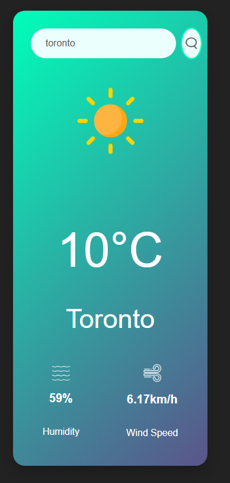

# 🌤️ Weather App

A sleek, responsive weather web app built with **HTML, CSS, and JavaScript**, powered by the **OpenWeatherMap API**. Search for any city in the world and get real-time weather updates with smooth visuals and intuitive design.

---

## 🚀 Features

- 🔎 **City-based Search** – Enter any city to get instant weather updates
- 🌡️ **Current Temperature** – Auto-refreshes based on query
- 💧 **Humidity & Wind Speed** – Clean display of additional metrics
- 🎨 **Responsive UI** – Mobile-friendly layout with modern CSS design
- 🌄 **Dynamic Icons** – Weather icons change based on API data
- 🔔 **Error Handling** – Displays message for invalid cities

---

## 🖥️ Live Preview

> Coming soon via GitHub Pages...

---

## 🛠️ Tech Stack

| Frontend       | Styling        | APIs & Libraries     |
|----------------|----------------|------------------------|
| HTML5          | CSS3           | [OpenWeatherMap](https://openweathermap.org/api) |
| JavaScript     | Flexbox/Grid   | N/A                   |

---

## 🧠 How It Works

1. User enters a city name.
2. App sends a request to the OpenWeatherMap API.
3. API responds with temperature, humidity, wind speed, and condition.
4. Based on the response, a relevant icon is shown.
5. Displays results or an error message if the city isn’t found.

---

## 📸 Screenshots

| Desktop View |
|--------------|
|  |

